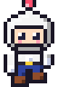
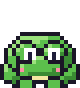
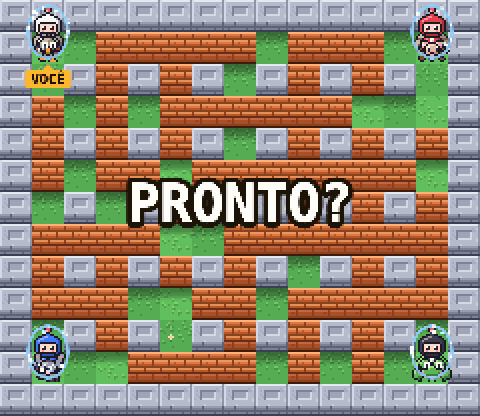
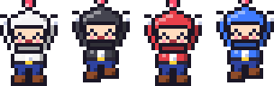
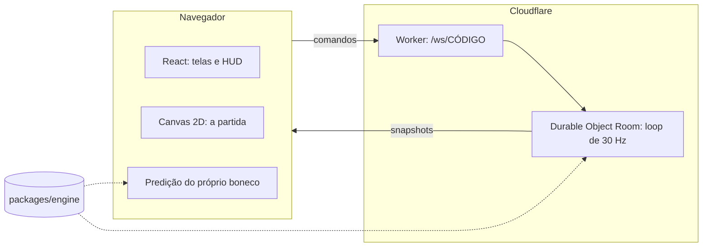
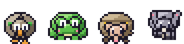

<h1 align="center">
  
  &nbsp;Bomb Arena&nbsp;
  
</h1>

<p align="center">
  <b>Bomba, fogo e amizades postas à prova.</b><br>
  Batalha de bombas online para até 4 jogadores, direto no navegador. Sem instalar, sem cadastro e sem piedade.
</p>

<p align="center">
  <a href="https://bomb-arena-ten.vercel.app"></a>
</p>

<p align="center">
  
  
  
  
  
  
  
</p>

<p align="center">
  
  <br>
  <sub>Gravado no jogo: o branco contra 3 bots no Difícil, no mapa Clássico, com todos os itens ligados (<code>?itens=todos</code>).</sub>
</p>

## 💣 Que jogo é esse?

Sabe aquele jogo do SNES em que quatro amigos se trancam num labirinto, cada um com bombas e nenhuma vontade de dividir a vitória? É isso, só que online. Crie uma sala, mande o link no grupo e em segundos tem gente explodindo gente. Também dá para treinar contra bots ou jogar a dois no mesmo teclado.

A inspiração são os Super Bomberman 1 a 4, mas tudo aqui é original: cada pixel, cada música e cada *kaboom* sai de código. Nenhum sprite ou som foi copiado.

<p align="center">
  
  <br>
  <sub>Quatro cores, um só sobrevivente.</sub>
</p>

## 🧨 O que tem na arena

- **Online de verdade:** sala com código de 5 letras ou link de convite, de 2 a 4 vagas, bots para completar a sala, série "melhor de 3 / 5" e pódio contando quem explodiu quem.
- **11 mapas:** Clássico, Campo Aberto, Labirinto e Quadrantes; Duelo e Confronto para o x1; e cinco com mecânica própria: esteiras na Linha de Montagem, Portais, gelo no Lago Congelado, caixotes no Armazém e fendas de lava no Vulcão.
- **17 itens:** além de mais bombas, mais fogo e mais velocidade, dá para chutar, socar e arremessar bombas, detonar à distância, atravessar tijolos e bombas, vestir colete, pegar a caveira (6 maldições, e passam por contato), plantar bomba perfurante, de borracha (quica e volta) ou mina enterrada.

  

- **4 pets para montar:** ema, sapo, tatu e jumento, cada um com um poder (disparar, pular 2 casas, empurrar tijolo, chutar forte). E eles aguentam uma explosão no seu lugar.
- **Bots** em três níveis: Fácil, Normal e Difícil (esse não perdoa).
- **No celular também:** em pé ou deitado, com controles na tela, vibração e instalação na tela inicial (PWA). Controle de videogame funciona.
- **Trilha sintetizada:** música de lobby, música de batalha e efeitos, tudo gerado na hora com Web Audio.

## ⚙️ Por dentro

| Camada | O que usa |
|---|---|
| Linguagem | TypeScript `strict` e ESM, num monorepo de Bun workspaces |
| Regras do jogo | `packages/engine`: TypeScript puro e determinístico, o mesmo código no servidor e no cliente |
| Servidor | Cloudflare Workers + Durable Objects (SQLite, plano grátis), WebSocket, uma sala por objeto |
| Cliente | React 19 + Vite 7 para as telas e o HUD; a partida é desenhada em Canvas 2D, sem engine de jogo |
| Arte | Pixel art gerada por script, com um codificador PNG próprio e sem dependências |
| Som | Sintetizado em tempo real com Web Audio, sem nenhum arquivo de áudio |
| Hospedagem | Vercel (cliente) e Cloudflare (servidor), tudo no free tier |
| Testes | `bun test`: 292 testes em cerca de 1 s, mais um e2e contra o servidor |



Algumas escolhas que fazem diferença:

- **O servidor manda.** O cliente só envia comandos; quem decide quem explodiu é a sala, rodando a 30 ticks por segundo.
- **Resposta na hora, mesmo longe.** A Cloudflare não hospeda Durable Objects na América do Sul, então a ida e volta do Brasil leva uns 140 ms. O cliente prevê o próprio boneco rodando as mesmas funções da engine e corrige com suavidade quando o servidor discorda.
- **Os outros andam lisos** graças a uma reserva de reprodução que se ajusta à rede (1 a 3 ticks).
- **Snapshots enxutos:** o tabuleiro só vai quando muda, e jogadores e bombas só com o que mudou. Numa partida de 4, cada snapshot caiu de ~2,7 KB para ~650 bytes.
- **Determinismo:** nada de `Math.random()` nas regras. O acaso sai de um gerador com semente, então todo bug vira um teste que se repete.
- **Efeitos fora da engine:** sons, partículas, tremor e vibração saem da diferença entre dois estados. A engine nem sabe que eles existem.

Detalhes em [docs/ARCHITECTURE.md](docs/ARCHITECTURE.md) (como funciona), [docs/DECISIONS.md](docs/DECISIONS.md) (por quê) e [docs/ROADMAP.md](docs/ROADMAP.md) (o que vem por aí).

## 🕹️ Controles

| Ação | Teclado | Controle |
|---|---|---|
| Mover | WASD ou setas | direcional ou analógico |
| Bomba | Espaço ou Enter | A |
| Ação (soco, luva, detonar a remota) | Shift | B |
| Poder do pet | E ou / | Y |

No celular aparecem botões na tela. M liga e desliga a música, N os efeitos sonoros, e o ⚙️ tem volume, vibração e "reduzir movimento".

## 🛠️ Rodar localmente

Precisa de [Bun](https://bun.sh) e do Node do `.nvmrc`.

```bash
bun install
bun run dev:all      # servidor (wrangler, :8787) e cliente (Vite, :5173)
```

Abra `http://localhost:5173` em várias abas: cada aba é um jogador. Se a tela ficar em "Conectando…", o servidor da porta 8787 não está rodando (`bun run dev:server` sobe só ele).

No treino contra bots e no modo local, alguns atalhos ajudam a testar:

- `?itens=todos`: começa com vários itens e pets;
- `?pet=runner|jumper|pusher|kicker`: escolhe o pet;
- `?vinganca=1`: liga o modo vingança;
- `?tempo=<segundos>`: encurta o relógio para ver o sudden death.

| Comando | O que faz |
|---|---|
| `bun run test` | Testes da engine, das salas e da predição do cliente |
| `bun run typecheck` | Checagem de tipos da engine, do cliente e do servidor |
| `bun run build` | Build de produção do cliente |
| `bun run e2e [url]` | Teste ponta a ponta contra um servidor rodando (padrão: o local) |
| `bun run sprites` | Gera de novo as sprites do jogo e as figuras deste README |

## 🚀 Deploy (free tier)

1. **Servidor:** `cd apps/server && bunx wrangler login && bunx wrangler deploy`. Hoje ele está em `wss://bomb-arena-server.bombarena.workers.dev`.
2. **Cliente:** o repositório está ligado à Vercel, que publica a cada push na `master` (o `vercel.json` configura o build). A variável `VITE_SERVER_URL` aponta para o servidor.

Quando o protocolo muda, publique o servidor antes de fazer o push do cliente.

## 📁 Estrutura

- `packages/engine`: regras do jogo, salas, protocolo e bots
- `apps/server`: Cloudflare Worker + Durable Object
- `apps/web`: cliente em React + Canvas
- `tools`: gerador de sprites e teste ponta a ponta
- `docs`: arquitetura, decisões e roadmap

Vai trabalhar no código com um agente de IA? As instruções estão em [CLAUDE.md](CLAUDE.md) (o [AGENTS.md](AGENTS.md) aponta para ele).

<p align="center">
  
  <br>
  <sub>Nenhum pet se feriu na produção deste jogo. Quer dizer, só os que levaram uma explosão no seu lugar.</sub>
</p>
